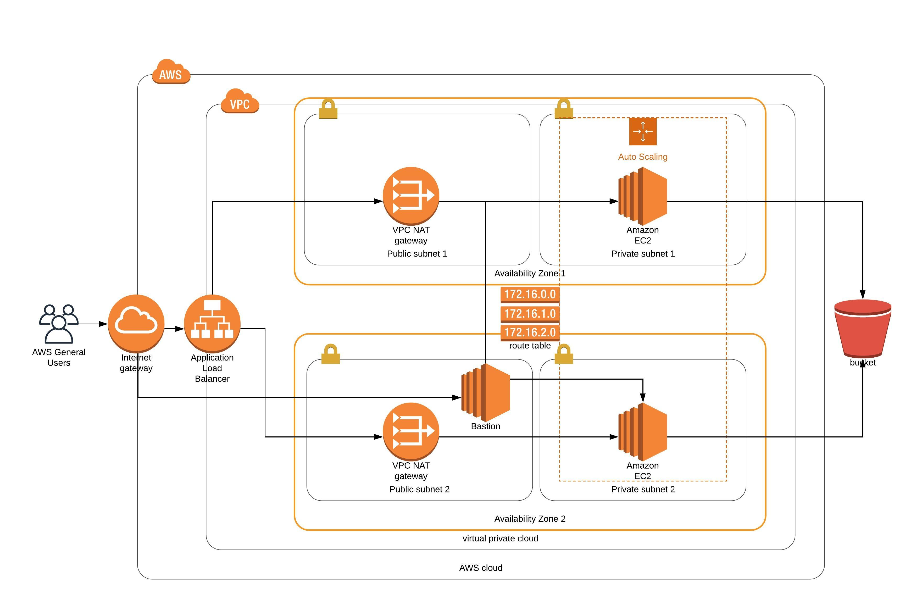

# nano-devops-02

Project 2 of the Udacity Nanodegree:

Using Cloud Formation: deploy an application (Apache Web Server) and pick up code (JavaScript and HTML) from S3 Storage and deploy it in the appropriate folder on the web server.

## Architecture diagram



## How to run

```bash
# enter your credentials for AWS account
aws configure

# set up network infrastructure
./scripts/awsCoUp.sh network cf/network.yml cf/network-parameters.json

# wait for the network stack to complete before running, set up servers
./scripts/awsCoUp.sh servers cf/servers.yml cf/servers-parameters.json
```
